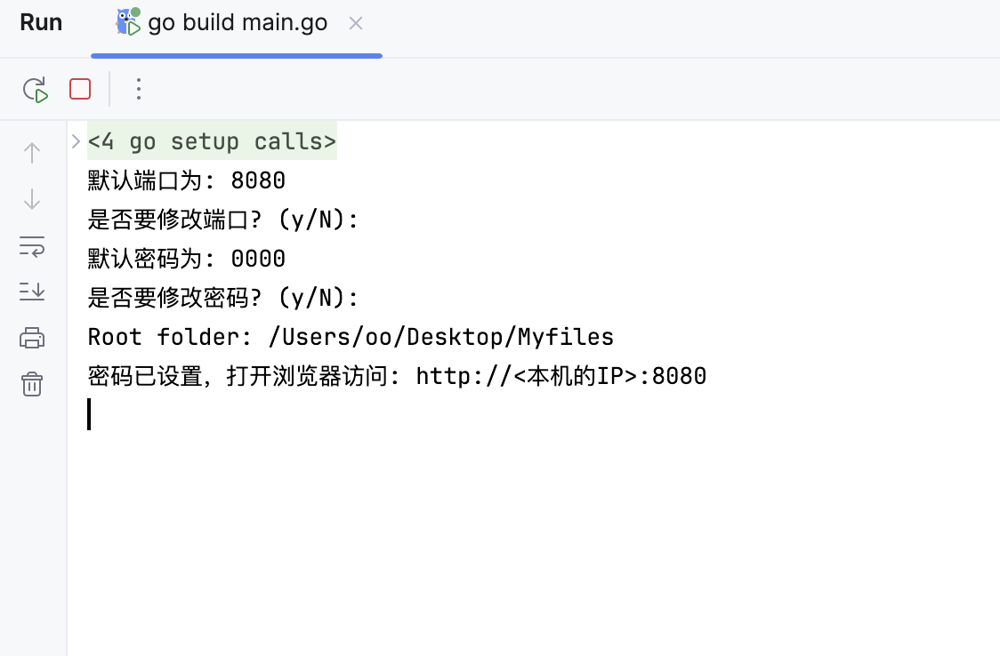
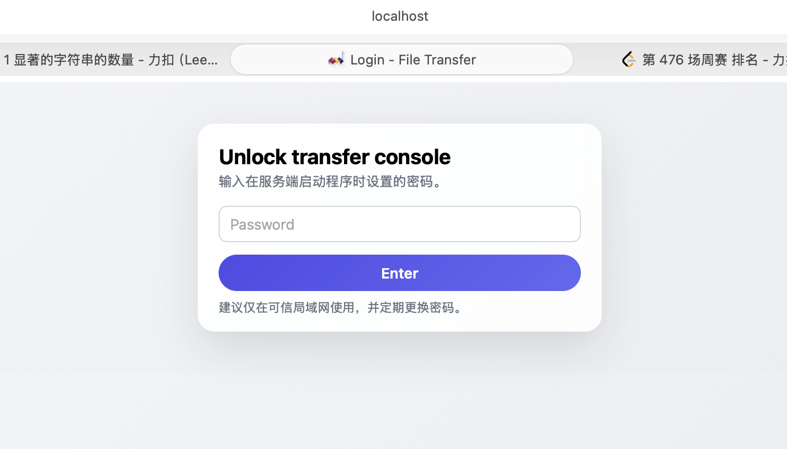
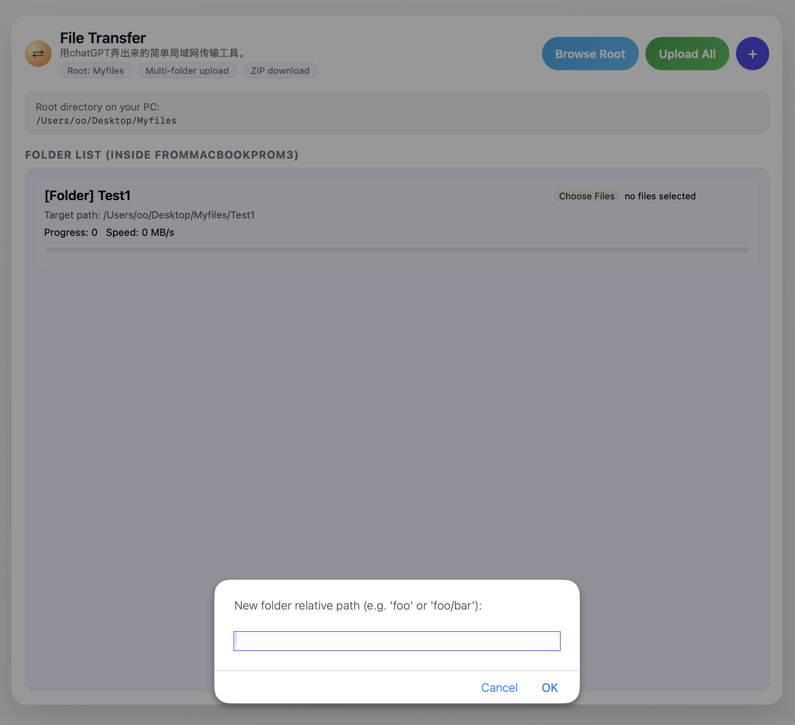
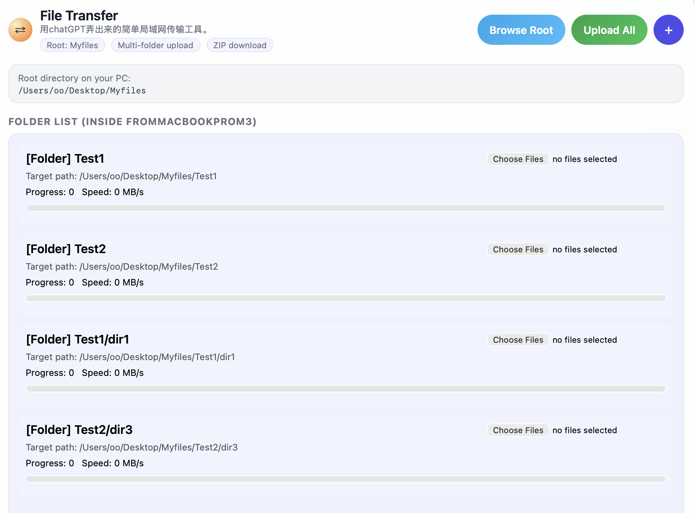
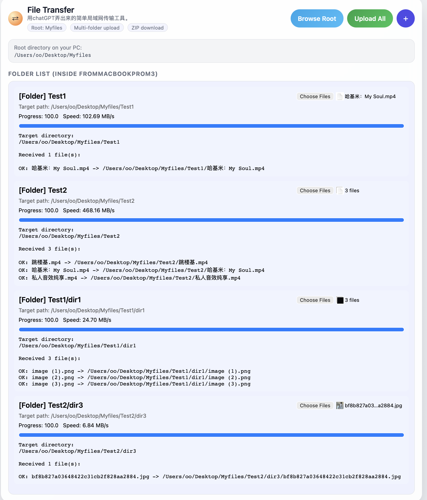
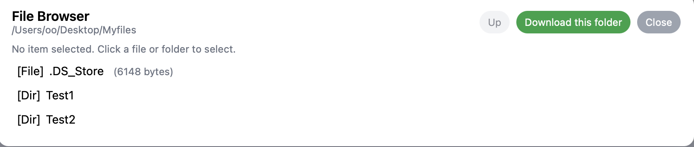
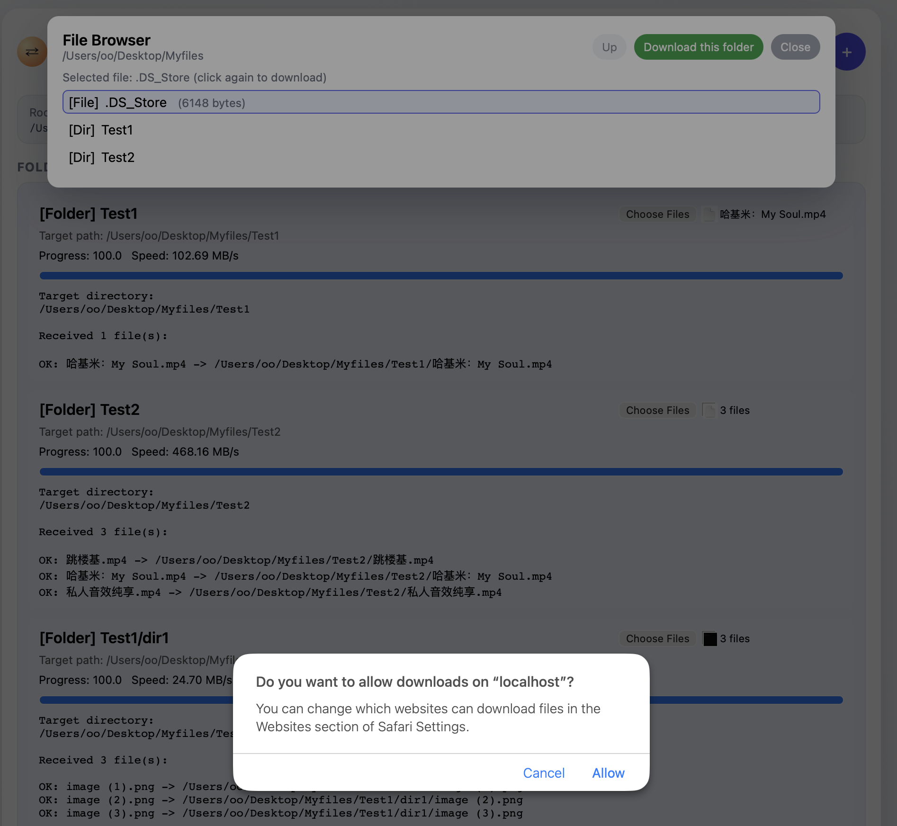

# FileTransfer —— 局域网文件传输工具

## 1. 项目简介

FileTransfer 是一个基于局域网的轻量级文件传输工具，用于在同一网段内快速分享文件。
支持启动服务端并通过 HTTP 或自定义协议在局域网中进行上传/下载操作，适合在家里 / 宿舍 / 实验室临时传文件使用。
其实就是老套的文件服务器，然后根据自己的需求让 AI 写了个狗屎前端（我更狗屎，我都不会前端:D），编写的一个满足我个人需求（暂时）的小工具。

### 只是单纯的自己拉屎，自己吃屎

> ⚠️ 注意：本工具仅面向可信局域网环境设计，未做（懒得做且真没必要吧）严格的安全加固，请勿直接暴露在公网环境中。

拉屎原因：我自己办公习惯差，喜欢用 Mac 办公，但是吧又怕出错，学校那些文件啊，word 的 docx 啊啥的又不敢在 Mac 上折腾，这学校又一大堆材料要填要弄，用微信传来传去搞得人恼火。传个视频去剪辑，手机录像可以 AirDrop 到 Mac 剪辑，但是 Win 打游戏的录屏搞到 Mac 上也是恼火。总之就是恼火，就拉了这坨。

---

## 2. 功能与使用
### 💩 1. 支持自定义端口和没什么🥚用的密码：
<p align="center">
  
  
</p>

### 💩 2. 关于文件夹
- 🤡 首先，会默认在你的桌面创建一个 Myfiles 文件夹，如果有的话，就会用那个并且一开始就能显示一些信息。一切上传下载起点在这里，没搞自定义没搞七七八八，就是在桌面的/Myfiles下。
- 🤡 点击➕加号可以创建文件，可以递归创建。
<p align="center">
    
</p>
    比如创建一个 Test1，就会在你的桌面的 Myfiles 下创建一个 Test1 文件夹，但是是假创建，你真的在这个文件夹里上传了文件才能真创建，否则刷新后 Test1 就没了。
    
- 🤡 关于 FolderList部分，它会把你所有的文件夹（包括子文件夹）都一行行列出来，这是失败的设计，没想好，以后要改的。
<p align="center">
    
</p>

### 💩 3. 关于上传
- 🤡 在失败设计的 FolderList中，每一行都会表达一个文件夹，你可以选择在这里上传文件（ChooseFiles），可以选多个，也可以给多个文件夹同时选择，然后点击上方的 Upload All，开始上传。
<p align="center">
    
</p>

- 🤡 上传只能给 Myfiles 下的文件夹里上传，Myfiles 下不能上传文件……这GPT给我懵了。
### 💩 4. 关于下载
- 🤡 上面的BrowseRoot点开能够看到丑的批爆的文件结构界面。
<p align="center">
    
</p>

- 🤡 双击文件，可以下载文件。

<p align="center">
    
</p>

- 🤡 进入某个文件夹后，点击上方下载这个文件夹绿色按钮，可以下载整个文件夹，以压缩包形式。
MacOs的Safari这里有点逆天的，会自动解压缩还是什么反正不跟我的逻辑走啊，但是 IOS Safari 以及其他浏览器没这个问题。
<p align="center">
    
</p>

### 💩 5.碎碎念
🤡 有了上传和下载就满足我的不同 OS 设备之间互传的需求了，这个上传应该做成和下载一套类似逻辑的，这个FolderList太傻逼，最关键的是还是我最开始下意识让AI这样做的，纯逆天好吧。文件夹很多以及有很多子文件夹的情况下，上传时这里就会有一大堆 Lists，并且很难找到你要上传到哪里。


---

## 3. 编译与运行环境

- 开发语言：Go
- Go 版本：1.25
- 运行平台：支持 Linux / macOS / Windows（只要 Go 能编译）
- 客户端：浏览器

### 3.1 编译

```bash
go build -o FileTransfer main.go

